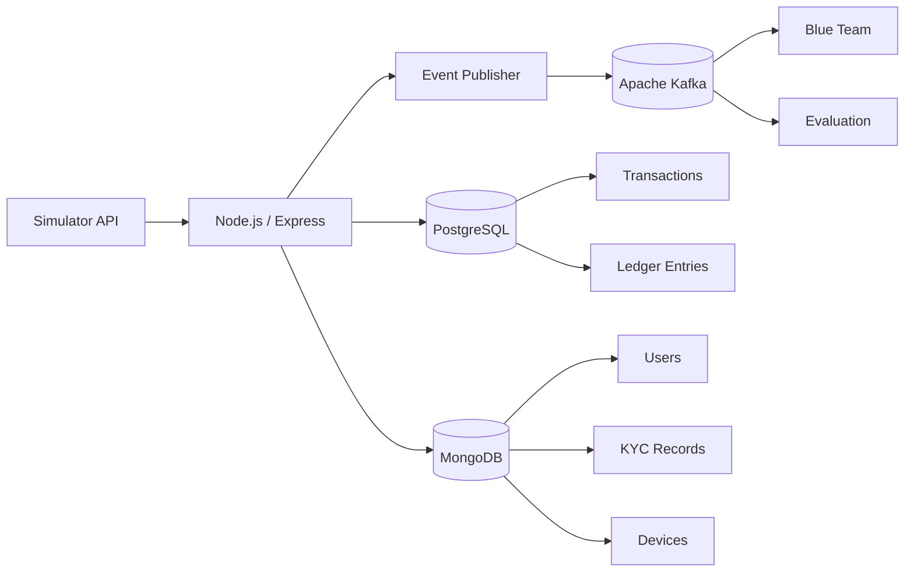
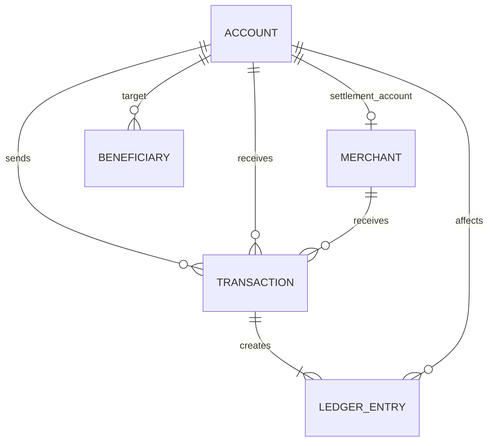

# 02 — Database Design

**Project:** Adversarial GenAI Framework for Proactive Testing of Payment-Fraud Defenses  
**Module:** M1 — Synthetic Banking Simulator  
**Document:** `02_database_design.md`  
**Version:** 1.0  
**Status:** Draft — Engineering Baseline  
**Date:** 2026-08-29

---

## 1. Purpose

This document converts the M1 simulator domain model into a concrete persistence design.

The project SDD specifies:

- Node.js/Express for core transactional logic.
- PostgreSQL for ACID-compliant ledger transactions.
- MongoDB for KYC and user-profile metadata.
- Apache Kafka for asynchronous event propagation.
- Simulator APIs for users, accounts, transactions, devices, KYC, beneficiaries and authentication events.

The database design below is an engineering proposal derived from those requirements. Fields, indexes and constraints that are not explicitly specified by the SDD are marked as proposed design decisions.

---

## 2. Database Responsibilities

### PostgreSQL

PostgreSQL is the system of record for strongly consistent financial state:

```text
accounts
merchants
beneficiaries
transactions
ledger_entries
```

The key requirement is ACID consistency for ledger transactions.

### MongoDB

MongoDB stores document-oriented synthetic profile information:

```text
users
kyc_records
devices
```

The SDD explicitly assigns KYC and user-profile metadata to MongoDB.

### Kafka

Kafka is not a database. It is the asynchronous event boundary between the simulator and downstream Blue Team/evaluation systems.

```text
Simulator
    |
    v
Event Publisher
    |
    v
Kafka
    |
    +--> Blue Team
    +--> Evaluation
```

---

# 3. Logical Data Architecture



---

# 4. PostgreSQL Schema

## 4.1 `accounts`

Stores synthetic financial accounts.

### Proposed columns

| Column | Type | Constraints | Description |
|---|---|---|---|
| `account_id` | UUID | PK | Internal account identifier |
| `user_id` | UUID | NOT NULL | Owner's synthetic user ID |
| `account_number` | VARCHAR | UNIQUE, NOT NULL | Synthetic account number |
| `account_type` | VARCHAR | NOT NULL | Account type |
| `currency` | CHAR(3) | NOT NULL | Currency code |
| `balance` | NUMERIC(19,4) | NOT NULL | Current balance |
| `status` | VARCHAR | NOT NULL | Account lifecycle state |
| `created_at` | TIMESTAMPTZ | NOT NULL | Creation timestamp |
| `updated_at` | TIMESTAMPTZ | NOT NULL | Last update timestamp |

### Important constraint

```text
balance >= 0
```

unless overdraft is explicitly introduced later.

### Note

`user_id` references a MongoDB user identifier conceptually. Because the user document lives in MongoDB, PostgreSQL cannot enforce a native cross-database foreign key. Referential integrity must therefore be enforced at the application/service layer.

---

## 4.2 `merchants`

Stores synthetic merchants.

### Proposed columns

| Column | Type | Constraints |
|---|---|---|
| `merchant_id` | UUID | PK |
| `merchant_name` | VARCHAR | NOT NULL |
| `merchant_category` | VARCHAR | NOT NULL |
| `settlement_account_id` | UUID | FK → accounts |
| `status` | VARCHAR | NOT NULL |
| `created_at` | TIMESTAMPTZ | NOT NULL |
| `updated_at` | TIMESTAMPTZ | NOT NULL |

A merchant may have a settlement account when the simulator models merchant settlement explicitly.

---

## 4.3 `beneficiaries`

Stores recipients registered by users.

### Proposed columns

| Column | Type | Constraints |
|---|---|---|
| `beneficiary_id` | UUID | PK |
| `user_id` | UUID | NOT NULL |
| `target_account_id` | UUID | FK → accounts |
| `nickname` | VARCHAR | |
| `status` | VARCHAR | NOT NULL |
| `created_at` | TIMESTAMPTZ | NOT NULL |
| `updated_at` | TIMESTAMPTZ | NOT NULL |

Again, `user_id` is application-level because the owning user is represented in MongoDB.

### Recommended uniqueness rule

For an MVP, prevent duplicate active beneficiary registrations for the same user and target account.

---

## 4.4 `transactions`

Stores the lifecycle and business information for financial transactions.

### Proposed columns

| Column | Type | Constraints |
|---|---|---|
| `transaction_id` | UUID | PK |
| `transaction_reference` | VARCHAR | UNIQUE, NOT NULL |
| `sender_account_id` | UUID | FK → accounts |
| `receiver_account_id` | UUID | FK → accounts, nullable |
| `merchant_id` | UUID | FK → merchants, nullable |
| `initiator_user_id` | UUID | NOT NULL |
| `amount` | NUMERIC(19,4) | NOT NULL |
| `currency` | CHAR(3) | NOT NULL |
| `transaction_type` | VARCHAR | NOT NULL |
| `channel` | VARCHAR | NOT NULL |
| `device_id` | UUID | nullable |
| `location` | JSONB | nullable |
| `status` | VARCHAR | NOT NULL |
| `created_at` | TIMESTAMPTZ | NOT NULL |
| `authorized_at` | TIMESTAMPTZ | nullable |
| `completed_at` | TIMESTAMPTZ | nullable |
| `failure_reason` | TEXT | nullable |
| `experiment_id` | UUID / VARCHAR | nullable |

### Validation rules

```text
amount > 0
```

Exactly one appropriate destination should be represented:

```text
receiver_account_id
OR
merchant_id
```

depending on transaction type.

The application layer should validate that a transaction does not contain contradictory destinations.

---

## 4.5 `ledger_entries`

Stores accounting movements.

### Proposed columns

| Column | Type | Constraints |
|---|---|---|
| `ledger_entry_id` | UUID | PK |
| `transaction_id` | UUID | FK → transactions |
| `account_id` | UUID | FK → accounts |
| `entry_type` | VARCHAR | NOT NULL |
| `amount` | NUMERIC(19,4) | NOT NULL |
| `balance_before` | NUMERIC(19,4) | NOT NULL |
| `balance_after` | NUMERIC(19,4) | NOT NULL |
| `created_at` | TIMESTAMPTZ | NOT NULL |

### Entry types

```text
DEBIT
CREDIT
```

### Critical rule

Ledger entries should be append-only from the application perspective.

Do not update historical ledger entries to repair balances. Corrections should be represented by compensating/reversal entries.

---

# 5. PostgreSQL Relationships



The relationship between `users` and PostgreSQL records is application-level because user profiles are stored in MongoDB.

---

# 6. MongoDB Collections

## 6.1 `users`

Stores synthetic user/profile metadata.

### Proposed document

```json
{
  "_id": "USR_001",
  "first_name": "Synthetic",
  "last_name": "Customer",
  "email": "user001@example.test",
  "phone": "+910000000001",
  "date_of_birth": "2000-01-01",
  "address": {
    "city": "Pune",
    "country": "IN"
  },
  "occupation": "student",
  "profile_status": "ACTIVE",
  "created_at": "2026-08-29T22:01:04Z",
  "updated_at": "2026-08-29T22:01:04Z"
}
```

All values must remain synthetic.

---

## 6.2 `kyc_records`

Stores synthetic KYC metadata.

```json
{
  "_id": "KYC_001",
  "user_id": "USR_001",
  "document_type": "SYNTHETIC_ID",
  "document_reference": "DOC_001",
  "verification_status": "VERIFIED",
  "liveness_status": "VERIFIED",
  "risk_profile": "STANDARD",
  "created_at": "2026-08-29T22:01:04Z",
  "updated_at": "2026-08-29T22:01:04Z"
}
```

No real identity documents or real PII should be stored.

---

## 6.3 `devices`

Stores synthetic device/network metadata.

```json
{
  "_id": "DEV_001",
  "user_id": "USR_001",
  "device_type": "MOBILE",
  "operating_system": "SYNTHETIC_OS",
  "browser": "SYNTHETIC_BROWSER",
  "ip_address": "192.0.2.10",
  "geo_location": {
    "country": "IN",
    "region": "MH"
  },
  "device_fingerprint": "SYNTHETIC_FP_001",
  "status": "ACTIVE",
  "first_seen": "2026-08-29T22:01:04Z",
  "last_seen": "2026-08-29T22:01:04Z"
}
```

---

# 7. Authentication Event Storage

The SDD defines `/auth_events` simulator API operations but does not explicitly settle the final persistence store for authentication events.

Therefore M1 should use an abstraction:

```text
AuthenticationService
        |
        v
AuthenticationEventRepository
        |
        +--> PostgreSQL / MongoDB / Event Archive
```

The concrete persistence decision should be made after considering the downstream event and analytics requirements.

At minimum, the event model must preserve:

```text
event_id
user_id
device_id
event_type
timestamp
simulation_id / experiment_id
metadata
```

---

# 8. Simulation Metadata

The SDD does not fully specify a database schema for simulation metadata.

A proposed PostgreSQL table is:

## `simulations`

| Column | Type | Constraints |
|---|---|---|
| `simulation_id` | UUID | PK |
| `experiment_id` | VARCHAR | NOT NULL |
| `status` | VARCHAR | NOT NULL |
| `seed` | BIGINT | nullable |
| `simulation_time` | TIMESTAMPTZ | NOT NULL |
| `started_at` | TIMESTAMPTZ | nullable |
| `ended_at` | TIMESTAMPTZ | nullable |
| `configuration` | JSONB | nullable |
| `created_at` | TIMESTAMPTZ | NOT NULL |

This is a proposed design and should be reviewed against the final experiment/evaluation module.

---

# 9. Status Constraints

Use application-level enums or PostgreSQL `CHECK` constraints.

## Account

```text
ACTIVE
SUSPENDED
FROZEN
CLOSED
```

## Merchant

```text
ACTIVE
SUSPENDED
CLOSED
```

## Beneficiary

```text
PENDING
ACTIVE
DISABLED
```

## Transaction

```text
INITIATED
AUTHORIZED
PROCESSING
COMPLETED
FAILED
REVERSED
```

## Simulation

```text
CREATED
INITIALIZING
READY
RUNNING
PAUSED
COMPLETED
FAILED
```

The exact state transitions remain the responsibility of domain services.

---

# 10. Index Design

## PostgreSQL

### Accounts

```text
UNIQUE(account_number)
INDEX(user_id)
INDEX(status)
```

### Transactions

Recommended indexes:

```text
UNIQUE(transaction_reference)
INDEX(sender_account_id, created_at)
INDEX(receiver_account_id, created_at)
INDEX(merchant_id, created_at)
INDEX(initiator_user_id, created_at)
INDEX(status, created_at)
INDEX(experiment_id, created_at)
INDEX(device_id, created_at)
```

### Ledger entries

```text
INDEX(transaction_id)
INDEX(account_id, created_at)
```

### Beneficiaries

```text
INDEX(user_id)
INDEX(target_account_id)
INDEX(user_id, status)
```

These are proposed indexes. Actual indexing should be validated against query patterns and measured workloads.

---

# 11. MongoDB Index Design

## `users`

```text
UNIQUE(_id)
UNIQUE(email)
INDEX(phone)
INDEX(profile_status)
```

## `kyc_records`

```text
INDEX(user_id)
INDEX(verification_status)
```

## `devices`

```text
INDEX(user_id)
INDEX(device_fingerprint)
INDEX(ip_address)
INDEX(status)
```

Indexes should be kept minimal initially and expanded based on simulator and Blue Team query requirements.

---

# 12. Transaction Atomicity

The most important database transaction is a successful financial transfer.

Conceptually:

```text
BEGIN
    |
    +-- Lock sender account
    |
    +-- Validate sender balance
    |
    +-- Validate destination
    |
    +-- Create transaction
    |
    +-- Debit sender
    |
    +-- Credit receiver
    |
    +-- Create debit ledger entry
    |
    +-- Create credit ledger entry
    |
COMMIT
```

If any operation fails:

```text
ROLLBACK
```

No partial financial state should remain.

---

# 13. Concurrency Control

Two simultaneous transactions must not incorrectly spend the same balance.

For a PostgreSQL implementation, the transaction service should use a database-level consistency strategy such as row locking during balance modification.

Conceptually:

```text
Transaction A
    |
    +--> lock Account X
    |
    +--> read balance
    |
    +--> update balance
    |
    +--> commit
             |
             v
        unlock Account X

Transaction B
    |
    +--> waits for Account X
```

The exact SQL isolation level and locking strategy should be finalized during implementation and tested under concurrent load.

---

# 14. Idempotency

Simulator APIs may receive retries.

Financial operations should therefore have an idempotency mechanism.

Proposed request concept:

```text
idempotency_key
```

For a transaction request:

```text
same idempotency_key
        |
        v
same logical transaction
        |
        v
no duplicate debit
```

The exact API representation belongs in `03_api_contract.yaml`.

---

# 15. Referential Integrity

### Within PostgreSQL

Use native foreign keys for:

```text
transactions -> accounts
transactions -> merchants
ledger_entries -> transactions
ledger_entries -> accounts
beneficiaries -> accounts
merchants -> settlement accounts
```

### Across MongoDB/PostgreSQL

Do not attempt database-level foreign keys.

Instead:

```text
Application Service
      |
      +--> validate user exists in MongoDB
      |
      +--> write PostgreSQL record
```

The service layer is responsible for maintaining consistency.

---

# 16. Deletion Strategy

Financial records should not be physically deleted as part of normal simulator operation.

Prefer:

```text
ACTIVE
   |
   v
DEACTIVATED / CLOSED
```

rather than:

```text
DELETE
```

For example:

- Closed account remains available for transaction history.
- Historical transactions remain queryable.
- Ledger entries remain immutable.
- User profile can be logically deactivated.

Hard deletion should be reserved for explicit test/reset workflows.

---

# 17. Event Data Boundary

Database state and event state are different concerns.

```text
PostgreSQL / MongoDB
        |
        | state
        v
Simulator Domain
        |
        | domain event
        v
Event Publisher
        |
        v
Kafka
```

The database should remain the source of truth for simulator state.

Kafka should provide the downstream event stream.

---

# 18. Event Envelope

The proposed common event envelope is:

```json
{
  "event_id": "EVT_001",
  "event_type": "TRANSACTION_COMPLETED",
  "event_version": 1,
  "timestamp": "2026-08-29T22:01:04Z",
  "simulation_time": "2026-08-29T22:01:04Z",
  "experiment_id": "EXP_001",
  "entity_type": "transaction",
  "entity_id": "TXN_001",
  "actor_id": "USR_001",
  "device_id": "DEV_001",
  "source": "bank_simulator",
  "payload": {}
}
```

This should eventually become the formal `04_event_contract.json`.

---

# 19. Database-to-Event Consistency

A major design issue is avoiding this state:

```text
Database COMMIT succeeds
        |
        X
Kafka publish fails
```

or:

```text
Kafka publish succeeds
        |
        X
Database COMMIT fails
```

For M1, domain services should therefore depend on an event-publishing abstraction.

A production-grade implementation can later use an outbox pattern:

```text
BEGIN DB TRANSACTION
      |
      +--> update financial state
      +--> write outbox event
      |
COMMIT
      |
      v
Outbox Publisher
      |
      v
Kafka
```

The outbox pattern is a proposed reliability improvement; it is not explicitly mandated by the current SDD.

---

# 20. Reset / Experiment Isolation

The simulator needs reproducible experiments.

Recommended isolation metadata:

```text
simulation_id
experiment_id
seed
```

Transactions and events should carry experiment context where relevant.

This enables:

```text
Experiment A
   |
   +--> users
   +--> accounts
   +--> transactions
   +--> events

Experiment B
   |
   +--> users
   +--> accounts
   +--> transactions
   +--> events
```

The exact strategy — separate database, schema, namespace, or logical IDs — is an implementation decision.

For the MVP, logical `simulation_id` / `experiment_id` partitioning is simpler.

---

# 21. Suggested SQL Schema Skeleton

```sql
CREATE TABLE accounts (
    account_id UUID PRIMARY KEY,
    user_id UUID NOT NULL,
    account_number VARCHAR(64) UNIQUE NOT NULL,
    account_type VARCHAR(32) NOT NULL,
    currency CHAR(3) NOT NULL,
    balance NUMERIC(19,4) NOT NULL CHECK (balance >= 0),
    status VARCHAR(16) NOT NULL,
    created_at TIMESTAMPTZ NOT NULL,
    updated_at TIMESTAMPTZ NOT NULL
);

CREATE TABLE merchants (
    merchant_id UUID PRIMARY KEY,
    merchant_name VARCHAR(255) NOT NULL,
    merchant_category VARCHAR(64) NOT NULL,
    settlement_account_id UUID REFERENCES accounts(account_id),
    status VARCHAR(16) NOT NULL,
    created_at TIMESTAMPTZ NOT NULL,
    updated_at TIMESTAMPTZ NOT NULL
);

CREATE TABLE transactions (
    transaction_id UUID PRIMARY KEY,
    transaction_reference VARCHAR(128) UNIQUE NOT NULL,
    sender_account_id UUID REFERENCES accounts(account_id),
    receiver_account_id UUID REFERENCES accounts(account_id),
    merchant_id UUID REFERENCES merchants(merchant_id),
    initiator_user_id UUID NOT NULL,
    amount NUMERIC(19,4) NOT NULL CHECK (amount > 0),
    currency CHAR(3) NOT NULL,
    transaction_type VARCHAR(32) NOT NULL,
    channel VARCHAR(32) NOT NULL,
    device_id UUID,
    location JSONB,
    status VARCHAR(32) NOT NULL,
    created_at TIMESTAMPTZ NOT NULL,
    authorized_at TIMESTAMPTZ,
    completed_at TIMESTAMPTZ,
    failure_reason TEXT,
    experiment_id VARCHAR(128)
);

CREATE TABLE ledger_entries (
    ledger_entry_id UUID PRIMARY KEY,
    transaction_id UUID NOT NULL REFERENCES transactions(transaction_id),
    account_id UUID NOT NULL REFERENCES accounts(account_id),
    entry_type VARCHAR(16) NOT NULL,
    amount NUMERIC(19,4) NOT NULL,
    balance_before NUMERIC(19,4) NOT NULL,
    balance_after NUMERIC(19,4) NOT NULL,
    created_at TIMESTAMPTZ NOT NULL
);

CREATE TABLE beneficiaries (
    beneficiary_id UUID PRIMARY KEY,
    user_id UUID NOT NULL,
    target_account_id UUID NOT NULL REFERENCES accounts(account_id),
    nickname VARCHAR(128),
    status VARCHAR(16) NOT NULL,
    created_at TIMESTAMPTZ NOT NULL,
    updated_at TIMESTAMPTZ NOT NULL
);
```

This is a schema skeleton, not the final migration set.

---

# 22. Repository Boundary

Application code should not scatter raw database access throughout controllers.

Recommended structure:

```text
HTTP Controller
      |
      v
Application Service
      |
      v
Domain Service
      |
      v
Repository Interface
      |
      +--> PostgreSQL Repository
      |
      +--> MongoDB Repository
```

Example:

```text
TransactionController
       |
       v
TransactionService
       |
       v
TransactionRepository
       |
       v
PostgreSQL
```

This keeps the domain layer independent from persistence details.

---

# 23. Recommended M1 Project Structure

```text
simulator/
├── src/
│   ├── api/
│   │   └── routes/
│   ├── application/
│   │   └── services/
│   ├── domain/
│   │   ├── entities/
│   │   ├── value-objects/
│   │   ├── events/
│   │   └── errors/
│   ├── infrastructure/
│   │   ├── postgres/
│   │   │   ├── repositories/
│   │   │   └── migrations/
│   │   ├── mongodb/
│   │   │   └── repositories/
│   │   └── kafka/
│   └── config/
├── tests/
│   ├── unit/
│   ├── integration/
│   └── e2e/
└── docs/
```

This structure is a proposed implementation organization.

---

# 24. Migration Strategy

Database schema changes must be version-controlled.

Recommended:

```text
migrations/
├── 001_create_accounts.sql
├── 002_create_merchants.sql
├── 003_create_beneficiaries.sql
├── 004_create_transactions.sql
├── 005_create_ledger_entries.sql
└── 006_add_indexes.sql
```

Never make undocumented manual schema changes on the shared development database.

---

# 25. Testing Requirements

## Unit tests

Test:

- State transitions
- Validation rules
- Transaction calculations
- Ledger calculations
- Idempotency logic

## Integration tests

Test:

- PostgreSQL repositories
- MongoDB repositories
- Cross-database service validation
- Transaction atomicity
- Concurrent transactions
- Event publishing abstraction

## End-to-end tests

At minimum:

```text
Create user
   ↓
Create account
   ↓
Create beneficiary
   ↓
Authenticate
   ↓
Create transaction
   ↓
Complete transaction
   ↓
Verify account balances
   ↓
Verify ledger entries
   ↓
Verify emitted events
```

---

# 26. Definition of Done

Database design is ready for implementation when:

- [ ] PostgreSQL responsibilities are fixed.
- [ ] MongoDB responsibilities are fixed.
- [ ] Core tables are defined.
- [ ] Core collections are defined.
- [ ] Relationships are defined.
- [ ] Primary keys are defined.
- [ ] Foreign keys are defined where possible.
- [ ] Cross-database references are explicitly handled.
- [ ] State constraints are defined.
- [ ] Financial invariants are defined.
- [ ] Transaction atomicity is defined.
- [ ] Concurrency strategy is defined.
- [ ] Indexes are proposed.
- [ ] Deletion strategy is defined.
- [ ] Event/database consistency strategy is identified.
- [ ] Migration strategy is defined.
- [ ] Open questions are recorded.

---

# 27. Open Decisions

The following should be resolved before implementation is considered complete:

1. Exact PostgreSQL version.
2. Exact MongoDB version.
3. ORM/ODM choice.
4. UUID generation strategy.
5. Exact transaction isolation level.
6. Account locking strategy.
7. Authentication-event persistence location.
8. Outbox pattern for Kafka reliability.
9. Experiment isolation strategy.
10. Whether external synthetic beneficiary accounts are supported.
11. Whether overdraft exists.
12. Exact reversal accounting rules.
13. Exact transaction types.
14. Data retention policy.
15. Backup/reset strategy.

These items are not fully specified by the current SDD and should not be treated as already-approved requirements.

---

# 28. Source Alignment

The database responsibilities in this document directly follow the project SDD:

- PostgreSQL is specified for ACID-compliant ledger transactions.
- MongoDB is specified for unstructured KYC and user-profile metadata.
- Kafka is specified for asynchronous simulator-to-Blue-Team event propagation.
- Simulator APIs cover users, accounts, transactions, devices, KYC, beneficiaries and authentication events.

The detailed schemas, indexes, repository layout, idempotency strategy, locking strategy and outbox proposal are engineering elaborations for M1 and require team review before being treated as final requirements.

---

# 29. Next Artifact

After approval of this document:

```text
M1/
├── M1_SCOPE.md
├── simulator-domain-model.md
├── 02_database_design.md       <- CURRENT
├── 03_api_contract.yaml        <- NEXT
├── 04_event_contract.json
└── README.md
```

The next implementation-facing artifact should be **`03_api_contract.yaml`**, because the Red Team, frontend, tests and future modules need a stable simulator API contract before they integrate with M1.
