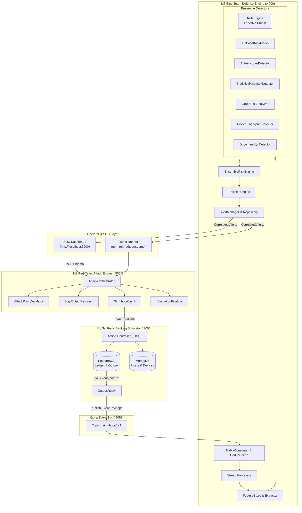

# AIPaySec

**Adversarial Payment Security & Defense Validation Platform**

AIPaySec is a synthetic payment security research platform designed to simulate multi-step adversarial fraud attacks against a realistic financial banking environment and validate whether defensive detection pipelines correctly identify, correlate, and respond to threats in real time.

---

## Overview

Traditional fraud and financial crime detection systems are commonly evaluated using static historical test datasets. However, real-world fraud actors operate dynamically: they compromise credentials, enroll spoofed devices, bypass perimeter checks, and execute fraudulent fund transfers across dependency chains.

AIPaySec bridges this gap by providing an end-to-end synthetic environment where adversarial attack scenarios are programmatically dispatched against a banking backend, streaming security events into a defense pipeline that assesses risk and triggers mitigation actions.

### Core Architecture Loop

```
Attack Scenario Definition
       │
       ▼
Red-Team Orchestrator (DAG Resolution & Parameter Interpolation)
       │
       ▼
Synthetic Banking Simulator (PostgreSQL / MongoDB)
       │
       ▼
Transactional Outbox Relay & Kafka Event Bus
       │
       ▼
Blue-Team Defense Engine (Feature Extraction & Risk Ensemble)
       │
       ▼
Decision Engine & Security Alert Generation
       │
       ▼
Detection Assessment & Defense Effectiveness Scoring
```

---

## Key Capabilities

- **Multi-Step Adversarial Attack Orchestration**: Directed Acyclic Graph (DAG) attack workflows with prerequisite resolution, timeout handling, and fail-fast execution.
- **Dynamic Step-Output References**: The `StepOutputResolver` allows downstream attack steps to dynamically consume runtime outputs (e.g. newly minted device UUIDs) via `{{steps.<step_id>.<path>}}` syntax without hard-coding identifiers.
- **Attack Policy Validation**: Static DAG validation via `AttackPolicyValidator` enforcing dependency ordering, syntax correctness, reference existence, and prototype traversal safety.
- **Synthetic Banking Simulator (M1)**: Dual-database persistence (PostgreSQL for double-entry financial ledgers and accounts; MongoDB for users, credentials, KYC, and devices) exposing RESTful simulator actions.
- **Transactional Outbox & Kafka Streaming**: Outbox-pattern event relay publishing canonical `EventEnvelope` payloads to Kafka topics (`simulator.auth.v1`, `simulator.devices.v1`, `simulator.transactions.v1`, etc.).
- **Ensemble Risk Detection (M5)**: Hybrid multi-model defense engine combining rule-based heuristics, statistical anomaly detection, autoencoder reconstruction error, tabular risk scoring, and graph topology cycle analysis.
- **Real-Time Security Alerts**: Automated alert lifecycle management tracking risk score, mitigation recommendations (`FREEZE_ACCOUNT`, `FLAG_REVIEW`), severity tiers, and rule triggers.
- **Detection Assessment & Scoring**: Correlation of attack execution metadata against defense alerts to measure detection outcome, detection latency (ms), and step-level coverage.
- **Cybersecurity SOC Dashboard**: Dark-themed single-page monitoring interface displaying live telemetry, dynamic state propagation, 9-stage pipeline progress, and correlated alert feeds.
- **Extensive Test Coverage**: Fully verified with 225 Red-Team tests and 552 platform-wide tests across 98 test suites.

---

## System Architecture



---

## Attack Demonstration Scenario

AIPaySec demonstrates a canonical three-step **Account Takeover (ATO) → Spoofed Device Registration → Fraudulent Transfer** scenario:

1. **Step 1: `SIMULATE_LOGIN`** (`ato-login-001`)
   - Authenticates the target user account using compromised credentials from an adversary IP (`198.51.100.99`).
2. **Step 2: `REGISTER_DEVICE`** (`spoofed-device-001`)
   - Enrolls an unrecognized mobile device signature (`Adversarial-Test-Agent`, `Android 14`).
   - The simulator persists the record and generates a real PostgreSQL/MongoDB device UUID (e.g. `c85dfaaf-2bd4-47eb-965c-1e3f488d983b`).
3. **Step 3: `PERFORM_TRANSACTION`** (`fraud-transfer-001`)
   - Initiates an unauthorized fund transfer ($1500.00) using the dynamic template reference:
     `"device_id": "{{steps.spoofed-device-001.device_id}}"`
   - `StepOutputResolver` dynamically intercepts this reference immediately prior to execution, resolves the actual device UUID from Step 2 output, and supplies the valid identifier to the simulator.

> **Note**: This environment is entirely synthetic. All operations are executed within local isolated PostgreSQL, MongoDB, and Kafka instances.

### Example Scenario Definition (Sanitized)

```json
{
  "scenario_id": "ato-device-transfer-001",
  "name": "Account Takeover to Fraudulent Transfer",
  "description": "Simulates credential compromise, spoofed hardware enrollment, and unauthorized balance transfer.",
  "steps": [
    {
      "step_id": "ato-login-001",
      "primitive_id": "PRIM_ACCOUNT_TAKEOVER_LOGIN",
      "action": "SIMULATE_LOGIN",
      "parameters": {
        "user_id": "3a0c3e7e-e3ca-416d-a1b6-b1335388b5d0",
        "email": "victim@example.com",
        "ip_address": "198.51.100.99",
        "success": true
      },
      "timeout_ms": 5000
    },
    {
      "step_id": "spoofed-device-001",
      "primitive_id": "PRIM_REGISTER_SPOOFED_DEVICE",
      "action": "REGISTER_DEVICE",
      "parameters": {
        "user_id": "3a0c3e7e-e3ca-416d-a1b6-b1335388b5d0",
        "device_type": "MOBILE",
        "operating_system": "Android 14",
        "browser": "Adversarial-Test-Agent",
        "ip_address": "198.51.100.99",
        "device_fingerprint": "spoofed-fingerprint-001"
      },
      "depends_on": ["ato-login-001"],
      "timeout_ms": 5000
    },
    {
      "step_id": "fraud-transfer-001",
      "primitive_id": "PRIM_EXECUTE_FRAUDULENT_TRANSFER",
      "action": "PERFORM_TRANSACTION",
      "parameters": {
        "initiator_user_id": "3a0c3e7e-e3ca-416d-a1b6-b1335388b5d0",
        "sender_account_id": "da78e50e-4bd4-4656-a9ac-9143d6ddadbb",
        "receiver_account_id": "9fa3e97e-529f-4b8a-93a2-5c3e824f0548",
        "amount": 1500.00,
        "currency": "USD",
        "channel": "MOBILE_APP",
        "device_id": "{{steps.spoofed-device-001.device_id}}"
      },
      "depends_on": ["spoofed-device-001"],
      "timeout_ms": 5000
    }
  ]
}
```

---

## Detection & Assessment Layer

When transactions occur, events pass from the simulator database outbox into Kafka topics. The Blue-Team stream processor consumes each event, computes running features across time windows, and evaluates risk using `EnsembleRiskEngine`.

### Detection Outcome Categories

- `DETECTED`: One or more security alerts correlated with the attack execution entities (`entity_id`, `device_id`, or `simulation_id`).
- `MISSED`: Attack completed successfully without triggering defensive alerts above the configured threshold.
- `PREVENTED`: An active defense mitigation rule (e.g. `FREEZE_ACCOUNT` or transaction block) stopped the attack before completion.

### Evaluation Metrics

- **Detection Latency**: Difference between initial attack execution timestamp and alert creation timestamp (typically 300ms – 800ms).
- **Severity Assessment**: Validates whether the alert severity (`CRITICAL`, `HIGH`, `MEDIUM`) matches the threat profile.
- **Step Coverage**: Percentage of executed attack steps monitored and evaluated by defensive models.
- **Effectiveness Score**: Normalized score indicating scenario execution fidelity and defensive response assessment.

---

## SOC Demonstration Dashboard

AIPaySec provides a built-in single-page cybersecurity dashboard accessible via browser at:

```
http://localhost:5000
```

### Dashboard Interface Elements

1. **Attack Simulation Card**: Displays scenario metadata, execution state, step progress, and the interactive `RUN ATTACK` action button.
2. **Runtime Generated State Card**: Shows dynamically resolved state values, including `Generated Device UUID` and persisted `Transaction ID`.
3. **Blue Team Detection Card**: Real-time display of alert count, detection status, severity tier, latency in milliseconds, and coverage percentage.
4. **Defense Effectiveness Card**: Comprehensive score breakdown (`100 / 100`) validating detection success and severity alignment.
5. **Attack Pipeline / Timeline**: 9-stage visual progression tracker with active status indicators:
   `Account Takeover` → `Successful Login` → `Spoofed Device Registration` → `Runtime Device UUID` → `Fraudulent Transfer` → `Kafka/Event Pipeline` → `Blue-Team Detection` → `Critical Alert` → `Detection Assessment`
6. **Security Alerts Feed Table**: Tabular view of correlated alerts with severity badges, risk scores, triggered rule IDs, detector sources, and timestamps.

---

## Running the Platform

### Prerequisites

- **Node.js**: v20.x or v22.x
- **PostgreSQL**: Running on `localhost:5432`
- **MongoDB**: Running on `localhost:27017`
- **Apache Kafka**: Running on `localhost:9092`

### 1. Installation

```bash
# Clone the repository
git clone https://github.com/Kanika0802/MasterCard_Project.git
cd MasterCard_Project

# Install dependencies
npm install
```

### 2. Database Initialization

```bash
# Run PostgreSQL schema migrations
npm run migrate

# Seed MongoDB collections
npm run mongo:init
```

### 3. Starting Platform Services

In separate terminal windows, start the core platform services:

```bash
# Terminal 1: Start M1 Synthetic Banking Simulator (Port 3000)
npm start

# Terminal 2: Start M5 Blue-Team Defense Engine (Port 4000)
npm run blueteam:start

# Terminal 3: Start M2 Red-Team API & Dashboard (Port 5000)
npm run redteam:start
```

### 4. Running the Live Command-Line Demo

```bash
npm run redteam:demo
```

**Representative Output:**
```
========================================
AIPaySec Red-Team / Blue-Team Demo
========================================

Scenario: ato-device-transfer-001
Execution: b185fa69-0f62-4437-95ab-8f48e14d925c

ATTACK
Status: SUCCESS
Steps: 3/3

DYNAMIC STATE
Generated Device ID: c85dfaaf-2bd4-47eb-965c-1e3f488d983b
Transaction: d2aaaf04-f379-49c2-bdd8-1d905ab8f931

DEFENSE
Alerts: 2
Detection: DETECTED
Severity: CRITICAL
Detection latency: 773ms
Coverage: 100%

EFFECTIVENESS
Score: 100/100

========================================
```

---

## Testing & Quality Assurance

The test suite validates domain invariants, DAG validation, dynamic parameter resolution, financial double-entry accounting, Kafka contracts, and ensemble risk models.

```bash
# Run Red-Team test suite
npm run test:redteam
# Output: 225 passing tests across 27 suites

# Run entire platform test suite
npm run test:all
# Output: 552 passing tests across 98 suites
```

### Test Suite Breakdown

| Suite Group | Command | Test Count | Scope |
|:---|:---|:---:|:---|
| **Red-Team & Resolver** | `npm run test:redteam` | 225 | Attack orchestrator, step output resolver, policy validator, evaluation pipeline |
| **M1 Simulator** | `npm run test:simulator` | 89 | PostgreSQL transactions, MongoDB persistence, ledger invariants, outbox relay |
| **M3 Attack Primitives** | `npm run test:m3` | 74 | Primitive definitions, parameter validation, action mappings |
| **M5 Blue Team Defense** | `npm run test:m5` | 164 | Feature extraction, 7 detection rules, ML/anomaly detectors, alert manager |
| **Full Platform** | `npm run test:all` | **552** | End-to-end integration and all module test suites |

---

## API Overview

### Simulator Service (`http://localhost:3000`)

| Method | Endpoint | Purpose |
|:---|:---|:---|
| `GET` | `/health` | Simulator health check |
| `GET` | `/api/v1/simulator/users` | List synthetic user accounts |
| `GET` | `/api/v1/simulator/accounts` | List synthetic bank accounts and balances |
| `POST` | `/api/v1/simulator/actions` | Execute transactional banking action |

### Blue-Team Defense Service (`http://localhost:4000`)

| Method | Endpoint | Purpose |
|:---|:---|:---|
| `GET` | `/api/v1/defense/health` | Blue-team service health status |
| `GET` | `/api/v1/defense/alerts` | Query security alerts with status/severity filters |
| `GET` | `/api/v1/defense/alerts/:alertId` | Retrieve detailed security alert by ID |
| `GET` | `/api/v1/defense/metrics` | Telemetry, stream volume, and model statistics |
| `GET` | `/api/v1/defense/rules` | List registered detection rule descriptors |
| `POST` | `/api/v1/defense/evaluate/transaction` | Synchronous risk assessment for transactions |

### Red-Team Execution Service (`http://localhost:5000`)

| Method | Endpoint | Purpose |
|:---|:---|:---|
| `GET` | `/health` | Red-team API health status |
| `GET` | `/` | Serve SOC Security Demonstration Dashboard |
| `POST` | `/api/v1/red-team/execute` | Execute arbitrary validated `AttackScenario` |
| `POST` | `/api/v1/red-team/demo` | Trigger canonical ATO attack scenario and return correlated evaluation |
| `GET` | `/api/v1/red-team/demo` | Retrieve demo execution report |

---

## Security Design & Hardening

- **Prototype Traversal Protection**: `StepOutputResolver` and `AttackPolicyValidator` block path keys containing `__proto__`, `prototype`, and `constructor` to prevent prototype pollution attacks.
- **DAG Dependency Validation**: `AttackPolicyValidator` verifies that every referenced step exists and is an explicit declared ancestor in the dependency graph.
- **Self-Reference & Cycle Detection**: Circular references and steps referencing their own outputs are caught during static validation before execution.
- **Fail-Fast Execution**: If an upstream dependency fails or times out, downstream dependent steps are skipped immediately without executing invalid actions.
- **Isolation by Design**: All simulator actions mutate only synthetic local records, ensuring zero external exposure.

---

## Repository Structure

```
d:/AipaySec/
├── attack-primitives/          # M3 Attack primitive catalog & definitions
│   ├── src/definitions/        # Authentication, Device, Transaction primitives
│   └── tests/                  # Primitive unit and integration tests
├── blueteam/                   # M5 Blue-Team Defense & Fraud Detection Engine
│   ├── src/alerts/             # AlertManager and AlertRepository
│   ├── src/detectors/          # RuleEngine, ML models, GraphRiskAnalyzer
│   ├── src/ensemble/           # EnsembleRiskEngine
│   ├── src/features/           # FeatureStore & FeatureExtractor
│   ├── src/stream/             # KafkaConsumer & StreamProcessor
│   └── tests/                  # Blue-Team unit and integration tests
├── docs/                       # Technical architecture and guides
│   ├── architecture.md         # Comprehensive system architecture
│   ├── attack-scenarios.md     # Attack DAGs & dynamic reference mechanics
│   ├── detection-and-evaluation.md # Feature extraction, risk models & scoring
│   └── demo.md                 # Live demonstration and walkthrough guide
├── red-team/                   # M2 Red-Team Attack Orchestrator
│   ├── src/api/                # Express API routes and server bootstrap
│   ├── src/demo.js             # Standalone demonstration runner
│   ├── src/evaluation/         # EvaluationPipeline & EffectivenessScorer
│   ├── src/orchestrator/       # AttackOrchestrator & StepOutputResolver
│   ├── src/public/             # SOC Security Dashboard (index.html)
│   ├── src/validator/          # AttackPolicyValidator
│   └── tests/                  # Red-Team test suites (225 tests)
├── simulator/                  # M1 Synthetic Banking Simulator
│   ├── src/api/                # REST endpoints for simulator actions
│   ├── src/domain/             # Account, Transaction, and Ledger entities
│   ├── src/infrastructure/     # PostgreSQL and MongoDB connection pools
│   ├── src/outbox/             # OutboxRelay transactional publisher
│   └── tests/                  # Simulator persistence & atomicity tests
├── docker-compose.yml          # Local Kafka, PostgreSQL, MongoDB containers
└── package.json                # Project configuration, scripts, and dependencies
```

---

## Technology Stack

| Component Layer | Technology | Role |
|:---|:---|:---|
| **Runtime** | Node.js (v22.x) | Core application execution runtime |
| **API Framework** | Express.js (v5.x) | HTTP RESTful endpoints and static asset delivery |
| **Event Streaming** | Apache Kafka / KafkaJS (v2.x) | Distributed streaming platform for outbox telemetry |
| **Relational Database** | PostgreSQL / `pg` (v8.x) | Financial ledgers, account balances, and `event_outbox` |
| **Document Database** | MongoDB / `mongodb` (v7.x) | User profiles, authentication logs, device enrollments |
| **Testing** | Node.js Test Runner (`node:test`) | Native unit, integration, and E2E validation |
| **Frontend UI** | HTML5 / Vanilla CSS / Modern JS | Dark SOC cybersecurity monitoring dashboard |

---

## Limitations

- **Synthetic Environment**: The simulator provides realistic banking behavior and double-entry ledgers, but is strictly an evaluation sandbox.
- **Local Deployment**: Configured for local single-node multi-process execution (ports 3000, 4000, 5000, 9092).
- **Demonstration Scope**: Focuses on core account takeover, device spoofing, and transaction fraud workflows.

---

## Future Enhancements

- Support for asynchronous human-in-the-loop fraud analyst approval workflows.
- Integration of adaptive reinforcement-learning adversarial attack agents.
- Automated generation of MITRE ATT&CK / FiFi (Financial Fraud) threat matrix mappings.
- Persistent time-series database storage for historical evaluation benchmarks across model releases.

---

## License

ISC License (as specified in `package.json`).
